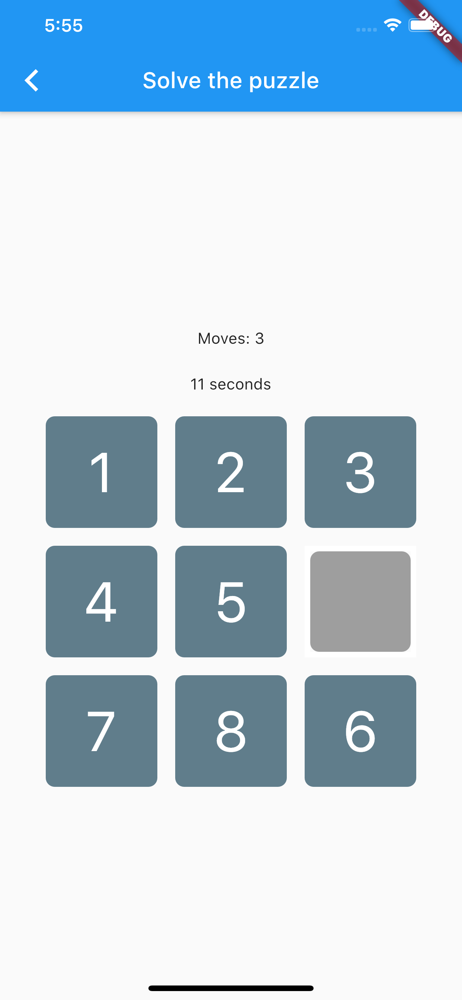

# Number Puzzle Game

A Flutter mobile game based off this puzzle:

**Figure: App is based off this game**

The board randomises the positions of the 8 tiles and the player has to reorder them.

It is only a 3 x 3 but hope to make it work for any square grid that is > a 2 x 2

